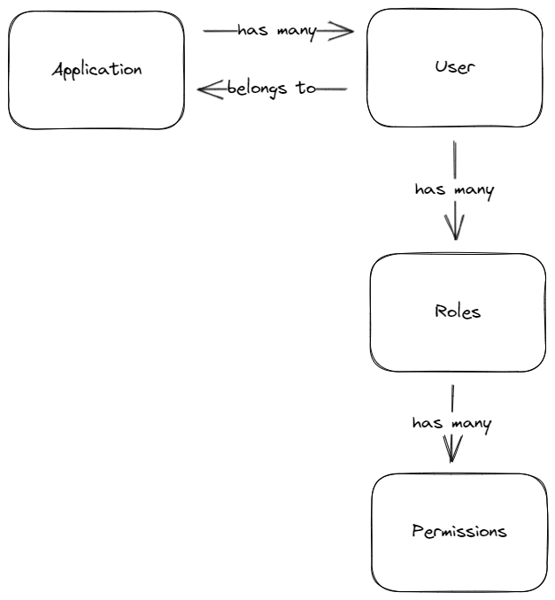
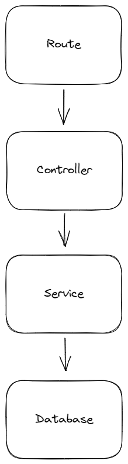

# Multi Tenant Role Based Access Control (RBAC) Authentication API

## Sponsor

Thank you to [Neon](https://bit.ly/tomdoestech) for sponsoring this video!

## Features
* Create an application
* Register a user for an application
* Login
* Create a role
* Assign a role to a user

* Check user permissions with a guard

## What are we using?
* [Drizzle ORM](https://github.com/drizzle-team/drizzle-orm)
* [Fastify](https://www.fastify.io/)
* [PostgreSQL](https://www.postgresql.org/)
* [TypeScript](https://www.typescriptlang.org/)

## What you'll need
* Editor - [VS Code](https://code.visualstudio.com/download)
* Node.js - [Download](https://nodejs.org/en/download/)
* A database - [PostgreSQL by Neon](https://bit.ly/tomdoestech)
* A REST client - [Thunder Client](https://marketplace.visualstudio.com/items?itemName=rangav.vscode-thunder-client)

## What you will learn
* How to create a multi tenant application
* How to create a role based access control system
* Some basic relational database concepts
* A nice and neat file structure for backend services
* TypeScript
* Fastify
* RESTful API design
* How to use Drizzle ORM

## Data structure

## Data flow

## Video structure
1. Setup the initial application
2. Create a database with Neon
3. Create database schemas
4. Run migrations
5. Register an application
6. Register a user
7. Login
8. Create a role
9. Assign a role to a user
10. Check user permissions with a guard

## Helpful files
* CMD - Commands used in the video
* api.json - Thunder Client collection

## Tips
* Infer the applicationId from the JWT where possible
* Include the applicationId in queries
